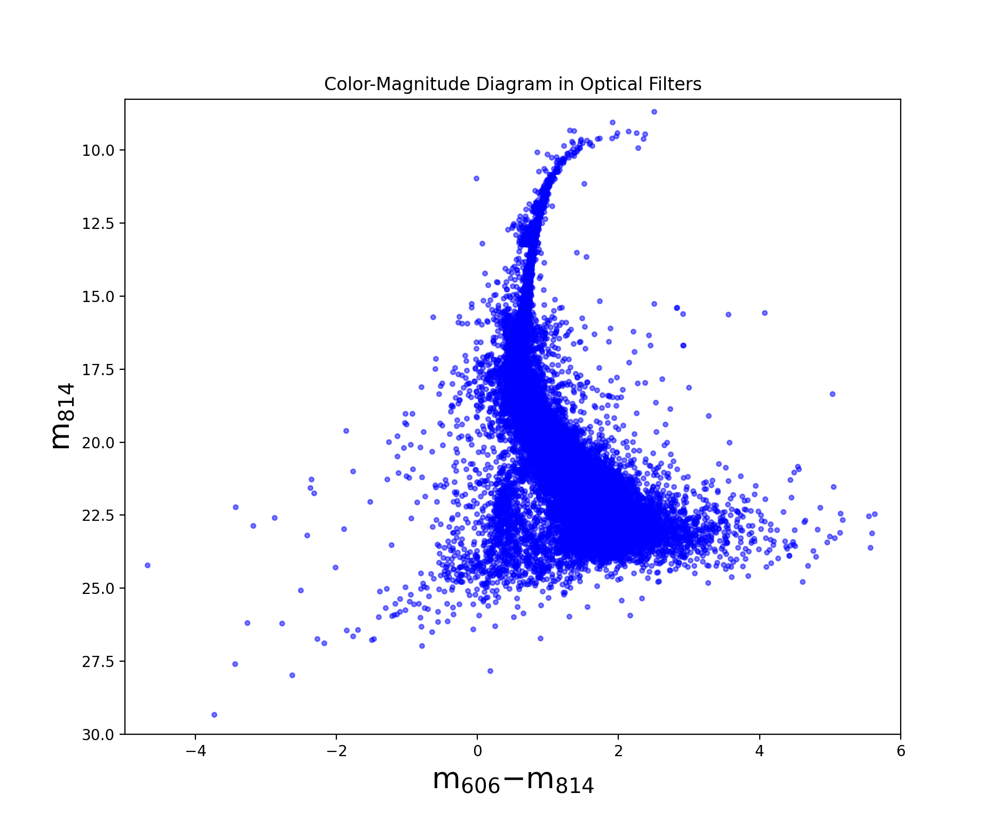
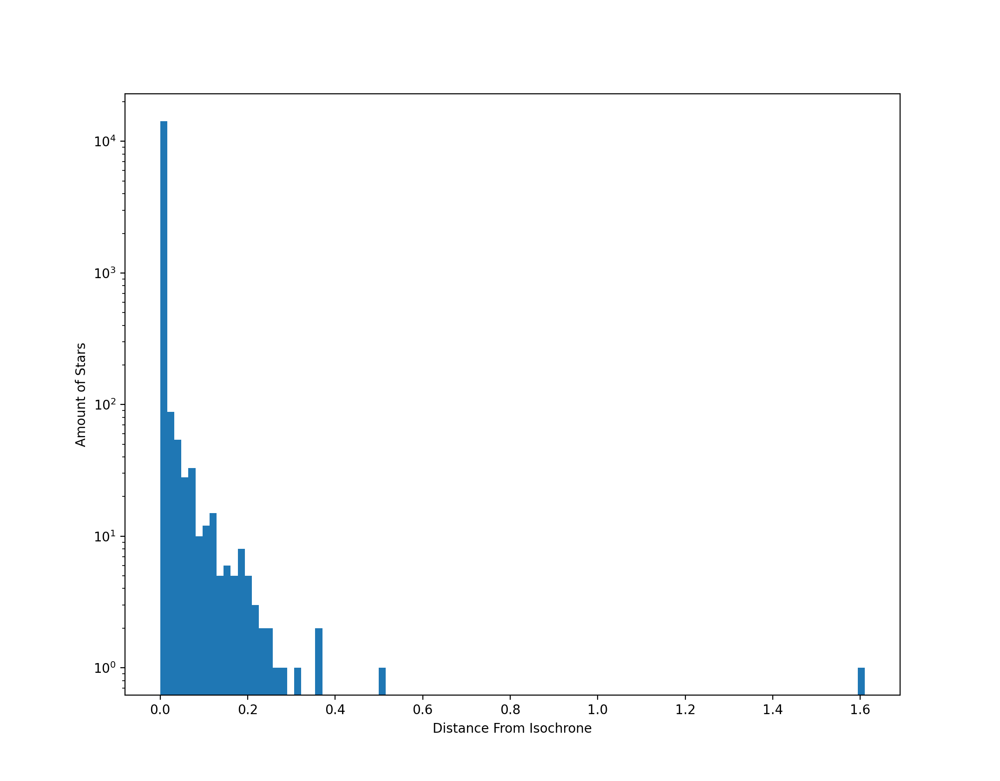

# Cleaning the Galaxy

## Introduction
Astronomers have been able to find over 150 globular clusters (GCs) in the Milky Way. They are a halo population, with increasing numbers toward the Galactic center. GCs are packed with as many of 100 to 1000 stars per cubic parsec. For comparison, the stars within the solar neighborhood are on the order of 1 parsecs apart. These dense GCs contain some of the oldest stars, Population II stars, within our galaxy with them being about 12 billion years old. Due to the old age of these stars, there is a lower metallicity in them compared to the younger Populations 1 stars like our Sun.

One of these GCs is 47 Tuc, also known as NGC 104. It is a massive GC that could be seen with the naked eye in the constellation of Tucana. Although this object is large in size and is the second brightest GC discovered, 47 Tuc wasn’t discovered by European astronomers until the 1750’s because of its location in the southern hemisphere, much farther south than the first GC, M22, which was found in 1665.

## Objectives
~ Removing stars that are not within 47 Tuc

~ Using MS isochrones, reduce the amount of non-singular, non-MS stars

~ Determine width of MS in order to see the internal error of Hubble

## You Can't Sit With Us

	

This is a Color-Magnitude Diagram. Every star that every gets measured by any telescope will eventually end up on here. The evolutionary cycle of stars has been studied for a long time now and depending on the mass of the star, we can predict how these stars move throughout the HR diagram as they age. Each star starts its life on the main sequence. The mass of the star determines the lifetime of a star on the main sequence. Which is why we'll be focusing on the main sequence. 

This graph gives us the probability of each star being within 47 Tuc. We had put the cut off point at p = 0.5, where we had only accepted stars that had a higher than 50% probability of being within the GC. Take note that the y axis is measured is on a log scale.

This is an image indicating which stars have been removed due to the probability of these stars being within 47 Tuc being below 50%. We can see that the width of the main sequence is decreased due to these stars taken out. 

# Here Come the Isochrones

# Is it a Fluke?

pvalue=1.6614302003444622e-48