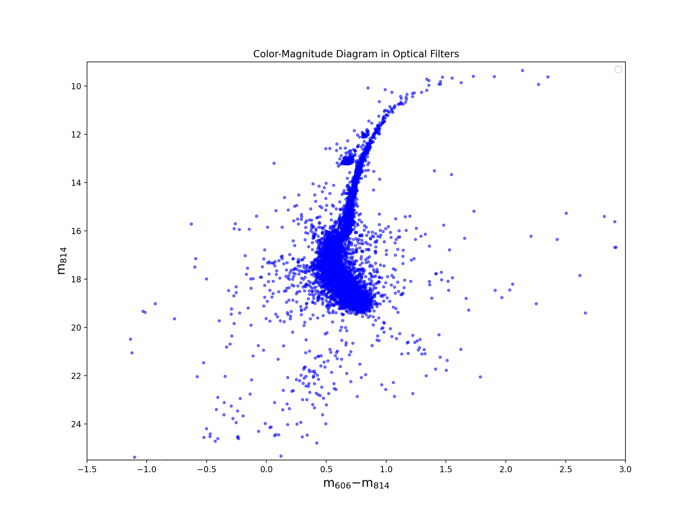
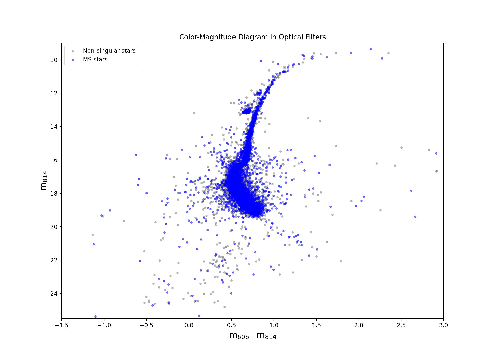
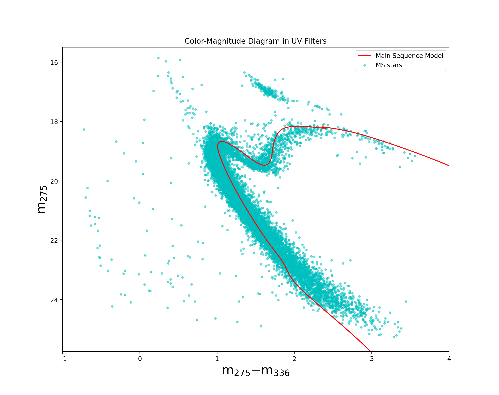
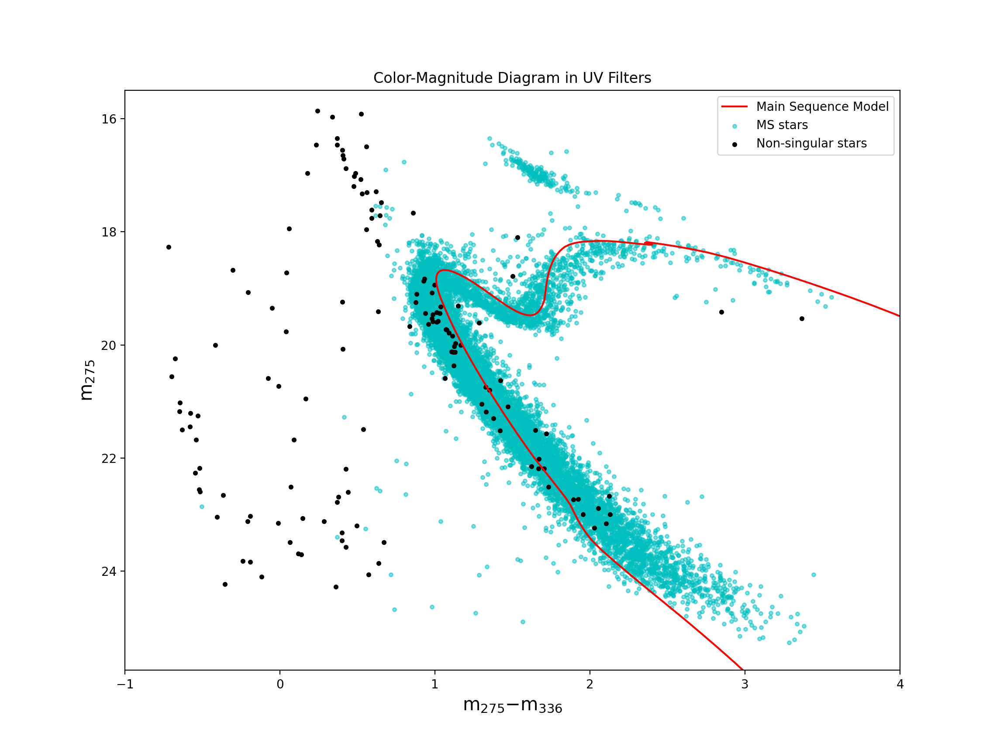

# Cleaning the Galaxy

## Introduction

Astronomers have been able to find over 150 globular clusters (GCs) in the Milky Way. They are a halo population, with increasing numbers toward the Galactic center. GCs are packed with as many of 100 to 1000 stars per cubic parsec. For comparison, the stars within the solar neighborhood are on the order of 1 parsecs apart. These dense GCs contain some of the oldest stars, Population II stars, within our galaxy with them being about 12 billion years old. Due to the old age of these stars, there is a lower metallicity in them compared to the younger Populations 1 stars like our Sun.

One of these GCs is 47 Tuc, also known as NGC 104. It is a massive GC that could be seen with the naked eye in the constellation of Tucana. Although this object is large in size and is the second brightest GC discovered, 47 Tuc wasn’t discovered by European astronomers until the 1750’s because of its location in the southern hemisphere, much farther south than the first GC, M22, which was found in 1665.

## Objectives
~ Removing stars that are not within 47 Tuc

~ Using MS isochrones, reduce the amount of non-singular, non-MS stars

~ Determine width of MS in order to see the internal error of Hubble

## You Can't Sit With Us

	

This is a Color-Magnitude Diagram (CMD). Every star that every gets measured by any telescope will eventually end up on here. The evolutionary cycle of stars has been studied for a long time now and depending on the mass of the star, we can predict how these stars move throughout the HR diagram as they age. Each star starts its life on the main sequence (MS). The mass of the star determines the lifetime of a star on the main sequence. Which is why we'll be focusing on the main sequence. 

This graph gives us the probability of each star being within 47 Tuc. We had put the cut off point at p = 0.5, where we had only accepted stars that had a higher than 50% probability of being within the GC. Take note that the y axis is measured is on a log scale.

This is an image indicating which stars have been removed due to the probability of these stars being within 47 Tuc being below 50%. We can see that the width of the main sequence is decreased due to these stars taken out. 

## Follow the Red Brick Road

The red line that we see going through the MS is called a Main Sequence Isochrone. This specific isochrone was chosen using the measured metal content of 47 Tuc. However, we still have to account for the distance to 47 Tuc because the measured brightness of stars dimishes the further we are from the light source. Another variable that has to be accounted for is the dust in the Milky Way which causes our stars to appear more red compared to their actual color. Both of these aspects have been taken into account when placing the isochrone. 

## Only Singles allowed

## Drumroll Please

Now that we have removed a large amount of the error that were caused by the stars themselves, we are now able to have a more accurate representation of how much internal error the HST has compared to where we first started. 

In order to get this graph, what I had done was to get the shortest distance from each star to the MS isochrone and put those values into this histogram. Due to the y-axis being measured in log, there is a lot of stars that are close to the isochrone as expected, but there are a few outliers around 1.6. 

In order to determine if there's any significance to the previous graph, we bootstrapped the data since plotting the distances from the isochrone doesn't have a normal distribution. This bootstrapping technique allows us to use the Central Limit Theorem to determine an interval where the mean will lie within a 95% confidence interval. In our case, our confidence interval is in between (0.0019, 0.0027). Although this is statistically significant to where it shows that Hubble does have an internal error, this interval is not meaningfully significant because these values are so low, this amount of error in the magnitude and colors will not change how we evaluate these stars.
